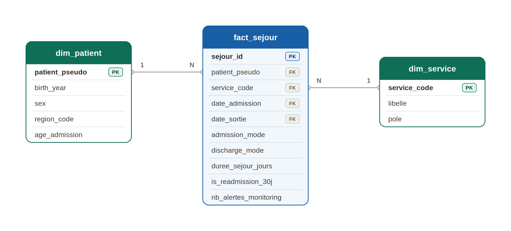
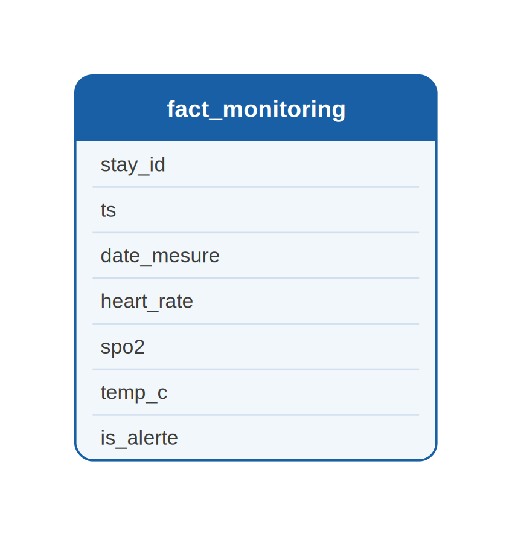
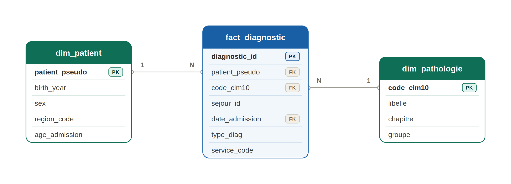

# Modèle de données — EDS CHU

Couche **Gold** de ClickHouse. Deux schémas en étoile indépendants, un par usage métier.

---

## Choix du star schema

On choisit le **schéma en étoile** plutôt qu'un schéma normalisé (3NF) ou en flocon (snowflake) pour plusieurs raisons :

- **Performance analytique** : ClickHouse est un moteur colonne taillé pour les agrégations massives. Avec un star schema, une requête `GROUP BY service_code` sur `fact_sejour` ne lit que les colonnes nécessaires sans jointure en cascade. Un schéma normalisé multiplierait les jointures et tuerait les performances sur de gros volumes.
- **Lisibilité pour Metabase** : les dashboards sont construits par des utilisateurs non-techniques (opérationnels, chercheurs). Une table de faits + quelques dimensions plates est bien plus navigable qu'un graphe de 10 tables normalisées.
- **Séparation claire fait / contexte** : la table de faits porte les mesures (durée, compteurs, flags) et les dates du grain (admission, sortie, mesure). Les dimensions portent le contexte (qui, quel service, quelle pathologie). Pas de `dim_temps` : ClickHouse extrait mois / année des colonnes date, une table calendrier n'apporterait rien à ce volume.

On ne choisit pas le flocon (snowflake) car les dimensions sont simples et peu volumineuses : normaliser `dim_pathologie` en `dim_chapitre → dim_groupe → dim_cim10` n'apporterait que de la complexité sans gain de stockage significatif.

---

## Dimension patient unifiée

Les deux schémas Gold (pilotage et recherche) partagent la **même définition de `dim_patient`** :

| Colonne | Type | Description |
|---|---|---|
| `patient_pseudo` | String | HMAC-SHA256(patient_id, sel_secret) — clé pseudonymisée |
| `birth_year` | Int | Année de naissance (date complète supprimée — quasi-identifiant RGPD) |
| `sex` | String | M / F normalisé en Silver |

`region_code` n'est **pas** dans `dim_patient`. Elle est dénormalisée dans `fact_sejour` (côté pilotage uniquement, là où elle est utile), conformément au principe de minimisation RGPD. Un chercheur n'y a structurellement pas accès.

> `nom`, `prenom`, `nir`, `birth_date` complète ne sont **jamais** présents dans l'entrepôt. Ils sont supprimés dès la copie vers le lake, avant toute insertion en Bronze.

---

## Schéma 1 — Pilotage hospitalier

> **Grain de la table de faits principale : un séjour hospitalier**




### Pourquoi ce grain pour fact_sejour ?

Le grain « un séjour » est le plus naturel pour le pilotage hospitalier : toutes les questions métier s'expriment à ce niveau (DMS *par séjour*, taux de réadmission = ratio de *séjours* suivant une sortie récente, activité urgences = nombre de *séjours* en urgence par jour). Un grain plus fin (journée de séjour, acte) rendrait les agrégations plus complexes sans valeur ajoutée pour ce tableau de bord. Un grain plus large (patient) effacerait la notion de passage, pourtant centrale en hôpital.

### Détail des tables

#### `fact_sejour`

| Colonne | Type | Description | Justification |
|---|---|---|---|
| `stay_id` | String | Clé naturelle du séjour | Fourni par la source, stable |
| `patient_pseudo` | String | FK → dim_patient | Pseudonyme HMAC déterministe — permet de compter les réadmissions sans exposer l'identité |
| `service_code` | String | FK → dim_service | Code pivot vers le libellé |
| `date_admission` | Date | Date d'entrée (sans heure) | Dégénérée sur la fact, pas une `dim_temps`. L'horodatage complet reste en Silver |
| `date_sortie` | Date | Date de sortie, NULL si séjour en cours | NULL est légitime (patient encore hospitalisé), pas une anomalie |
| `region_code` | String | Département de résidence du patient | Dénormalisé ici plutôt que dans dim_patient : un chercheur ne doit pas voir cette colonne. La mettre dans la fact du pilotage garantit un cloisonnement structurel |
| `admission_mode` | String | urgence / programme / mutation | Dénormalisé dans la fact — valeurs peu nombreuses, stables, pas une dimension à part entière |
| `discharge_mode` | String | domicile / mutation / transfert / deces / NULL | Idem |
| `duree_sejour_jours` | Float | Calculé en Silver : `discharge_ts - admission_ts` | Pré-calculé pour éviter le recalcul à chaque requête dashboard |
| `is_readmission_30j` | Bool | Vrai si sortie précédente du patient entre 1 et 30j avant cette admission | RÈGLE MÉTIER calculée en **Gold** (vue `gold_pilotage.fact_sejour`) par fenêtre glissante (`lagInFrame`) sur `patient_pseudo` — Silver ne fait que le nettoyage |
| `nb_alertes_monitoring` | Int | Nb de relevés du séjour avec `is_alerte = 1` | Agrégat de `gold_pilotage.fact_monitoring` — les seuils ne sont écrits qu'une fois |

#### `fact_monitoring`

Table de faits au grain **un relevé**. Pas de `dim_temps` ni de `dim_constantes` : `ts` / `date_mesure` suffisent, les noms de capteurs sont fixes.


| Colonne | Type | Description |
|---|---|---|
| `stay_id` | String | Identifiant du séjour (clé de jointure vers fact_sejour) |
| `service_code` | String | FK → dim_service (dénormalisé : le Parquet n'a que stay_id) |
| `ts` | DateTime | Horodatage de la mesure |
| `date_mesure` | Date | Date extraite de ts (pour filtrer par jour) |
| `heart_rate` | Float | Fréquence cardiaque (bpm) |
| `spo2` | Float | Saturation en oxygène (%) |
| `temp_c` | Float | Température corporelle (°C) |
| `alerte_desaturation` | UInt8 | 1 si SpO2 < 92 % (seuil clinique, défini en Gold) |
| `alerte_brady_tachycardie` | UInt8 | 1 si FC < 50 ou > 100 bpm (seuil clinique, défini en Gold) |
| `alerte_fievre` | UInt8 | 1 si température > 38,5 °C (seuil clinique, défini en Gold) |
| `is_alerte` | UInt8 | 1 si au moins un seuil clinique est franchi |

> Deux notions distinctes : en **Silver**, les plages de plausibilité (FC 20-250, SpO2 50-100, Temp 30-45) servent à ÉCARTER les relevés aberrants (capteurs en panne, valeurs sentinelles). En **Gold**, les seuils cliniques ci-dessus QUALIFIENT chaque relevé valide. Le nettoyage est une règle qualité (Silver), l'alerte est une règle métier (Gold).

> INNER JOIN sur `silver.fact_sejour` : un relevé dont le séjour a été écarté en Silver (incohérence temporelle) n'entre pas dans le mart. `nb_alertes_monitoring` sur `fact_sejour` est un `sum(is_alerte)` de cette vue — pas une seconde copie des seuils.

#### `dim_service`

| Colonne | Justification |
|---|---|
| `service_code` | Clé de jointure avec fact_sejour et fact_monitoring |
| `service_label` | Indispensable pour des dashboards lisibles (un code seul n'a pas de sens pour un opérationnel) |

---

## Schéma 2 — Recherche clinique

> **Grain de la table de faits : une occurrence de diagnostic sur un séjour**



> `stay_id` est absent de `fact_diagnostic` côté recherche : un chercheur ne doit pas pouvoir remonter au séjour de pilotage via une jointure. Le cloisonnement est structurel, pas uniquement déclaratif. Les vues KPI (prévalence, cohorte) lisent cette fact. Exception : `v_comorbidites` joint Silver en interne (`DEFINER`) pour apparier principal et associé au même séjour, sans exposer `stay_id`.

### Pourquoi ce grain ?

Un séjour peut avoir plusieurs diagnostics (un principal + plusieurs associés). Si le grain était le séjour, on devrait stocker les codes CIM10 dans un tableau, ce qui empêche le filtre et l'agrégation par pathologie en SQL standard. En choisissant le grain « une ligne par diagnostic », on répond directement à "combien de patients ont un code I25 ?" avec un simple `WHERE code_cim10 = 'I25'`. C'est le grain naturel pour la recherche clinique.

### Détail des tables

#### `fact_diagnostic`

| Colonne | Type | Description | Justification |
|---|---|---|---|
| `patient_pseudo` | String | FK → dim_patient | Même pseudonyme que côté pilotage — le sel est identique |
| `code_cim10` | String | FK → dim_pathologie | Pivot vers le libellé et la hiérarchie CIM-10 |
| `type_diag` | String | principal / associe | La prévalence compte tous les types ; la colonne permet de restreindre au principal si une étude l'exige |
| `age_au_diagnostic` | Int | Âge du patient au diagnostic | Calculé en Silver : `toYear(admission) - birth_year` |
| `mois_admission` | Date | Mois d'entrée du séjour | Date généralisée au mois (minimisation RGPD) — `stay_id`, `service_code` et `diagnostic_id` sont absents de la vue Gold |

#### `dim_patient` (partagée)

Identique au schéma pilotage — `patient_pseudo`, `birth_year`, `sex`. Pas de `region_code` (minimisation RGPD côté recherche).

#### `dim_pathologie`

| Colonne | Justification |
|---|---|
| `code_cim10` | Code source brut fourni dans diagnostics.json |
| `libelle` | Texte lisible pour les dashboards chercheurs |
| `chapitre` | Niveau hiérarchique haut de la CIM-10. Permet de filtrer par grande catégorie médicale sans connaître tous les codes |

La hiérarchie est dénormalisée dans `dim_pathologie` (pas de tables séparées) : le référentiel CIM-10 est stable, son volume est petit (~10 000 codes), et la dénormalisation ne pose pas de problème de cohérence.

---

## Règle petits effectifs (RGPD)

Toute agrégation côté recherche exposant une cohorte de **moins de 5 patients distincts** est supprimée du résultat avant restitution.

Implémentation : `HAVING COUNT(DISTINCT patient_pseudo) >= 5` sur toutes les requêtes d'agrégation du schéma recherche. Cette règle est appliquée au niveau des vues Gold (pas seulement dans Metabase) pour être effective quel que soit le client SQL.

---

## Cloisonnement des droits

| Schéma Gold | Groupe Metabase | Tables visibles |
|---|---|---|
| `gold_pilotage` | `operationnels` | fact_sejour, fact_monitoring, dim_patient, dim_service |
| `gold_recherche` | `chercheurs` | fact_diagnostic, dim_patient, dim_pathologie |

`dim_patient` est définie dans les deux bases avec le même contenu — elle ne contient aucune donnée permettant un croisement non autorisé.

---

## Vue d'ensemble des flux source → Gold

```
patients.csv       ──[pseudonymisation + suppression PII]──► dim_patient (pilotage + recherche)

sejours.csv        ──[contrôles qualité Silver]─────────────► fact_sejour
                                                               (region_code dénormalisée ici)

diagnostics.json   ──[dépliage JSON, 1 ligne/code]──────────► fact_diagnostic

monitoring.parquet ──[nettoyage Silver : aberrants écartés]──► fact_monitoring
                      (seuils cliniques + service_code ; nb_alertes_monitoring
                       agrégé depuis cette fact)

referentiels/      ──[chargement direct]─────────────────────► dim_service, dim_pathologie
```
