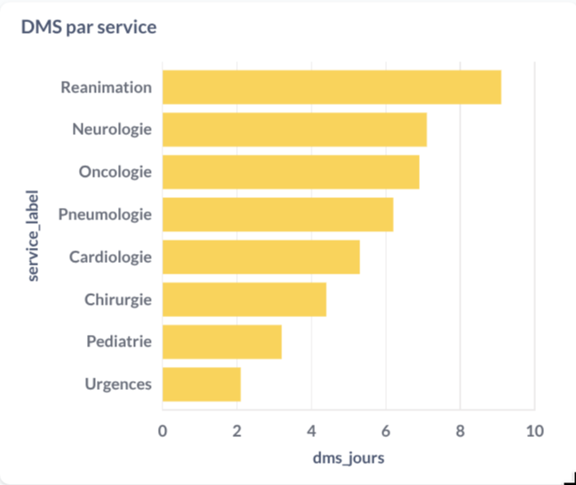
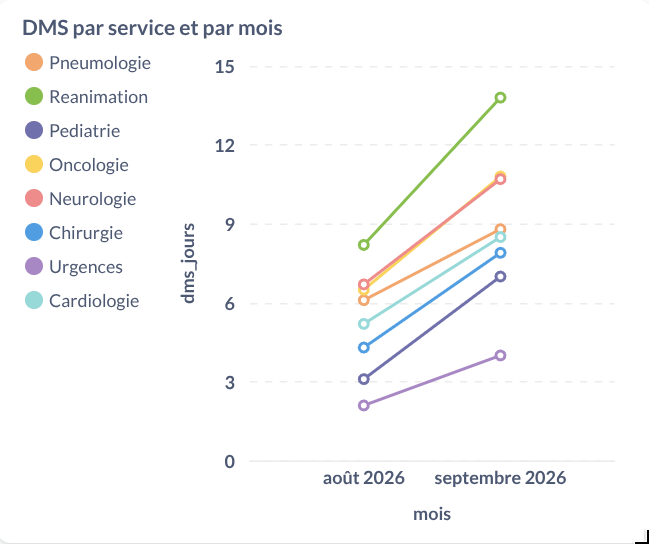
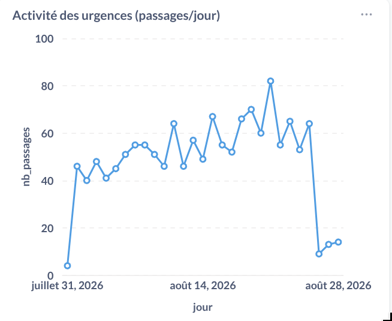
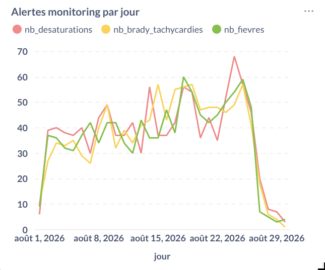
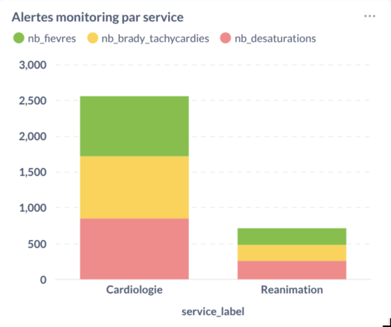
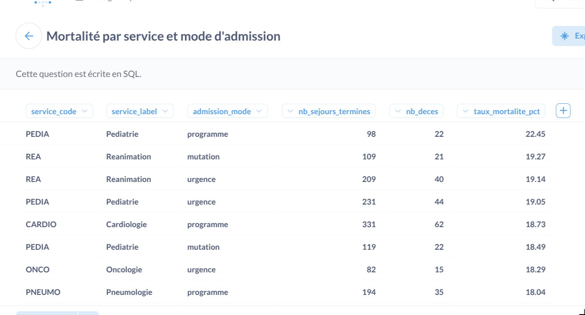
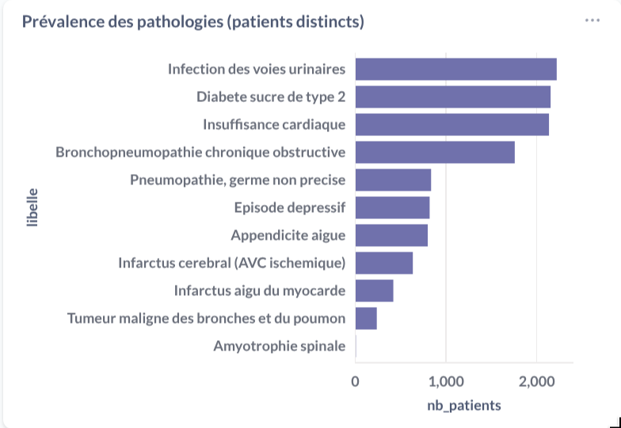
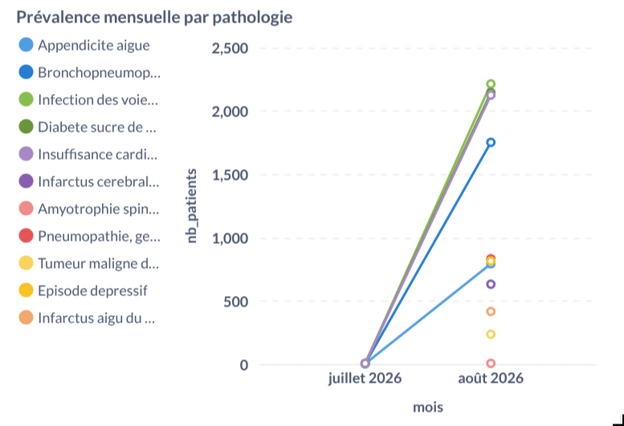
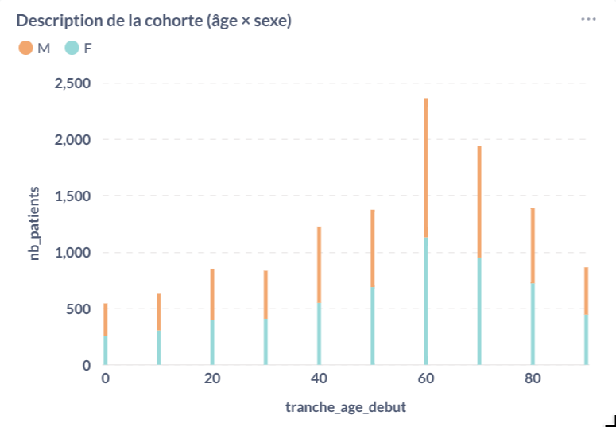
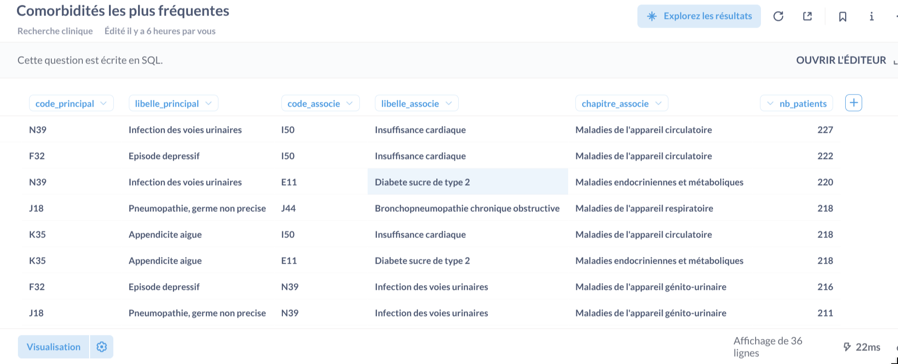

# Rapport Partie 1 : pipeline EDS-CHU et dashboards

Patron médaillon (lake → bronze → silver → gold) pour un EDS hospitalier.
Deux usages cloisonnés : **pilotage hospitalier** et **recherche clinique**.

Le modèle de données Gold (star schemas, grains, colonnes) est décrit à part :
[`modele-donnees.md`](modele-donnees.md). Les guides d'usage sont dans
[`guides/`](guides/lancement.md).

---

## 1. Architecture et choix techniques

Les transformations métier sont en **SQL ClickHouse**, pas en pandas.
ClickHouse exécute les agrégations côté serveur, sur des colonnes, sans
charger l'entrepôt en mémoire Python. Python orchestre (copie lake,
chargement Bronze, exécution des fichiers SQL).

| Couche | Rôle                                | Idempotence                                            |
|--------|-------------------------------------|--------------------------------------------------------|
| Lake   | Conformité RGPD uniquement          | Fichier déjà présent → skip                            |
| Bronze | Dépôt brut + `_source_date`         | `meta.pipeline_runs` : date `success` jamais rechargée |
| Silver | Qualité, dédup, enrichissement      | `CREATE OR REPLACE TABLE` à chaque run                 |
| Gold   | Règles métier + KPI + cloisonnement | `CREATE OR REPLACE VIEW` à chaque run                  |

Silver et Gold sont toujours reconstruits : ils ne sont pas incrémentaux, contrairement au Bronze
Un bug corrigé en Silver se répercute au run suivant, et le silver utilise toujours la dernière version du Bronze.

Les dates source ne sont pas toutes présentes dans `patients/` (photo cumulative sur les 3 derniers jours seulement). Le pipeline fait l'union des dates de toutes les tables ; un fichier manquant pour une date est ignoré, pas une erreur.

---

## 2. Lake

Le lake retire les PII avant ClickHouse :

- supprimés : `nom`, `prenom`, `nir`, `birth_date`, `patient_id`
- conservés : `birth_year`, `sex` normalisé (`M`/`F`), `region_code`
- `patient_id` → HMAC-SHA256(`patient_id`, `PIPELINE_SALT`)

HMAC plutôt que SHA256 simple : sans le sel, une attaque par dictionnaire sur la liste des IPP est inefficace. Le sel n'est pas en base (`.env` seulement).
Le même sel est appliqué aux patients et aux séjours : les jointures restent possibles via `patient_pseudo`.

Diagnostics, monitoring et référentiels n'ont pas de PII directe : copie brute. Le `stay_id` n'identifie un patient qu'en passant par la table séjours déjà pseudonymisée.

---

## 3. Bronze

Bronze n'écarte rien. Les séjours incohérents (`discharge_ts` ≤ `admission_ts`) et les relevés capteur aberrants restent lisibles pour l'audit. Filtrer ici ferait disparaître la preuve de l'anomalie.

Chaque ligne porte `_source_date`. `meta.pipeline_runs` enregistre succès / erreur par date : c'est le journal RGPD du chargement et le mécanisme d'incrément.

Sur le jeu actuel (activité du 1er au 28 août 2026, photos patients les
26–28 août) :

| Table            | Lignes Bronze                        |
|------------------|--------------------------------------|
| patients         | 18 000 (3 dumps cumulatifs de 6 000) |
| sejours          | 6 797                                |
| diagnostics      | 12 720                               |
| monitoring       | 41 778                               |
| services / cim10 | 8 / 13                               |

Anomalies identifiées ici, traitées en Silver : 68 séjours temporellement incohérents ; 858 relevés hors plage de plausibilité.

---

## 4. Silver

Silver applique les contrôles qualité. Les règles métier (réadmission, seuils cliniques d'alerte) sont volontairement hors Silver : ce n'est pas de la qualité de donnée, c'est de l'interprétation clinique / gestion (donc en Gold)

| Règle                                                                    | Traitement                 |
|--------------------------------------------------------------------------|----------------------------|
| Patients : dump cumulatif                                                | 6 000 patients             |
| Sexe hors M/F                                                            | écarté                     |
| Sortie ≤ admission                                                       | écarté (68)                |
| Diagnostics d'un séjour invalide                                         | écartés                    |
| Monitoring hors plage physiologique (FC 20–250, SpO2 50–100, Temp 30–45) | écarté                     |
| Chapitre CIM-10                                                          | enrichi 1re lettre du code |

Résultat : `fact_sejour` 6 729 séjours, `fact_monitoring` 40 920 relevés plausibles, sans flag d'alerte.

---

## 5. Gold

Deux schémas ClickHouse, deux comptes (`eds_pilotage`, `eds_recherche`), `SELECT` uniquement sur sa base. Les vues lisent Silver grâce à `SQL SECURITY DEFINER` : elles s'exécutent avec les droits du pipeline, pas ceux de l'appelant. Un chercheur ne peut pas voir à travers la vue jusqu'à `stay_id` ou `region_code`

Côté recherche, il y a une minimisation supplémentaire : pas de `stay_id` (ni `diagnostic_id`, qui l'encapsulait), pas de `service_code`, date ramenée au mois, cohortes < 5 patients masquées dans les vues et dans la fact (un `HAVING` Metabase seul serait contournable en SQL).

Le détail des tables est dans [`modele-donnees.md`](modele-donnees.md).

---

## 6. Dashboard Pilotage

Public : direction, cadres de santé. Grain principal : **le séjour**.
Captures à déposer dans `images/pilotage/` sous les noms indiqués.

### Fraîcheur des données

Sans ça, un opérationnel ne sait pas si le pipeline a tourné. La vue lit`meta.pipeline_runs`. Visualisation table : quelques indicateurs scalaires côte à côte (dernière date source, ancienneté,
runs en erreur).

### DMS par service

Besoin métier n°1. Barres horizontales : les libellés de service sont longs, l'oeil compare des longueurs. Un camembert n'a aucun sens (la DMS n'est pas une part d'un tout). Uniquement les séjours **terminés** : une durée n'existe qu'à la sortie. Hiérarchie attendue (réa la plus longue, urgences la plus courte), c'est un contrôle de vraisemblance.

### DMS par service et par mois

La photo globale ne dit pas si un service se dégrade. Axe temporel = mois de sortie (convention de pilotage : on rattache la DMS au moment où elle est connue). Une série par service.

### Activité des urgences

Filtre `service_code = 'URGENCES'`, pas `admission_mode = 'urgence'`.
Beaucoup d'admissions « urgence » atterrissent directement en cardio / neuro sans passer par le SAU : les compter ici fausserait l'activité du service.
La courbe par jour est plus pertinente car c'est un flux, pas un classement

### Taux de réadmission à 30 jours

C'est un ndicateur global de qualité des soins. Un chiffre, pas un graphique par service : ventiler par le service du nouveau séjour attribuerait la réadmission au mauvais service, celui qui réaccueille, pas celui qui a sorti. Fenêtre 1–30 jours (`lagInFrame`) : le même jour = mutation, pas une réadmission. Tous les séjours au dénominateur (y compris en cours) : la réadmission se juge à l'admission

### Alertes monitoring par jour

Seuils **cliniques** (Gold), distincts du nettoyage Silver :

- SpO2 < 92 % → désaturation
- FC < 50 ou > 100 → brady / tachycardie
- Temp > 38,5 °C → fièvre

Trois courbes, pas de total sur le même axe : le total (flag `is_alerte`) est 3 fois plus haut et écrase les types. `is_alerte` reste en base pour compter des relevés sans double-comptage (un relevé fébrile et
désaturé = 1 relevé en alerte).
Avoir trois courbes distinctes (désaturation, brady/tachycardie, fièvre) permet de visualiser l'évolution de chaque type d’alerte, qui ne partagent ni la même fréquence ni la même signification médicale. Une seule courbe totale écraserait les différences. Par exemple un pic de fièvre serait invisible dans la masse des désaturations et inversement. Distinguer les types aide à cibler les actions correctives, alors qu’un total ne renseigne ni sur la nature du problème ni sur ses causes

### Alertes par service

Même ventilation par type, agrégée par service. On voit à la fois le volume et le mix (désaturation vs fièvre n'appellent pas la même action). Le monitoring source n'a pas de `service_code` : la jointure séjour est pré-calculée en Gold pour ne pas la rejouer dans metabase

### Mortalité

Table (service et mode d'admission) : la mortalité en urgence et en programmé ne se comparent . Uniquement séjours terminés. Sur ce jeu synthétique le taux est très élevé (16 %) (vient des données pas du calcul)

### Séjours en cours

Liste opérationnelle (qui est là, depuis combien de jours, combien d'alertes), pas un KPI agrégé. `discharge_ts` NULL est légitime. `nb_alertes_monitoring` sur `fact_sejour` existe pour cette vue : un résumé par séjour, sans joindre 40k relevés dans metabse

---

## 7. Dashboard Recherche

Public : épidémiologistes. Grain : une occurrence de diagnostic

### Prévalence des pathologies

Taille de cohorte = patients distincts, tous types de diagnostics (principal et associé) : un diabétique hospitalisé pour un infarctus appartient à la cohorte diabète. Un patient multi-pathologies compte dans chaque cohorte. Les barres horizontales sont plus pertinentes car les libellés CIM-10 sont longs. Le classement est fait par par volume. `HAVING >= 5` : mucoviscidose et trisomie 21 masquées sur ce jeu pour éviter l'identification des patients

### Prévalence mensuelle

Pour détecter des tendances ou saisonnalités (photo globale sur l'axe du temps). Le seuil >= 5 est appliqué à chaque cellule (mois x pathologie) pour protéger la confidentialité : ainsi, la somme des valeurs mensuelles n'est pas égale au total global

### Description de cohorte

Tranches de 10 ans (généralisation) plutôt que l'âge exact. Empilé M/F : pyramide simplifiée, lisible en une carte. Mêmes cohortes que la prévalence (tous types de diagnostics), sinon les deux vues divergeraient

### Comorbidités

Paires (principal, associé) au sein d'un même séjour. La vue en table est plus pertinente est plus adaptée car il y a trop de combinaisons pour qu'un graphe soit lisible, et le chercheur peut filtrer par code.
`HAVING >= 5` est encore plus important ici car une combinaison rare de maladies est plus
identifiante qu'une pathologie isolée

---

## 8. Cloisonnement

Deux niveaux indépendants :

1. **ClickHouse** — `eds_pilotage` / `eds_recherche` n'ont `SELECT` que
   sur leur Gold (`step4_grants.py`). Bronze, Silver, `meta` et l'autre
   Gold → `ACCESS_DENIED`, y compris hors Metabase (port 8123).
2. **Metabase** — groupes `operationnels` / `chercheurs`, collections
   masquées. En OSS, « Blocked » (Enterprise) est remplacé par
   « no self-service » + collection `none`. Le niveau 1 reste la vraie
   serrure.

Les dashboards et droits applicatifs sont recréés par `python -m pipeline.metabase_setup` (idempotent). Procédure détaillée dans [`guides/metabase.md`](guides/metabase.md).
